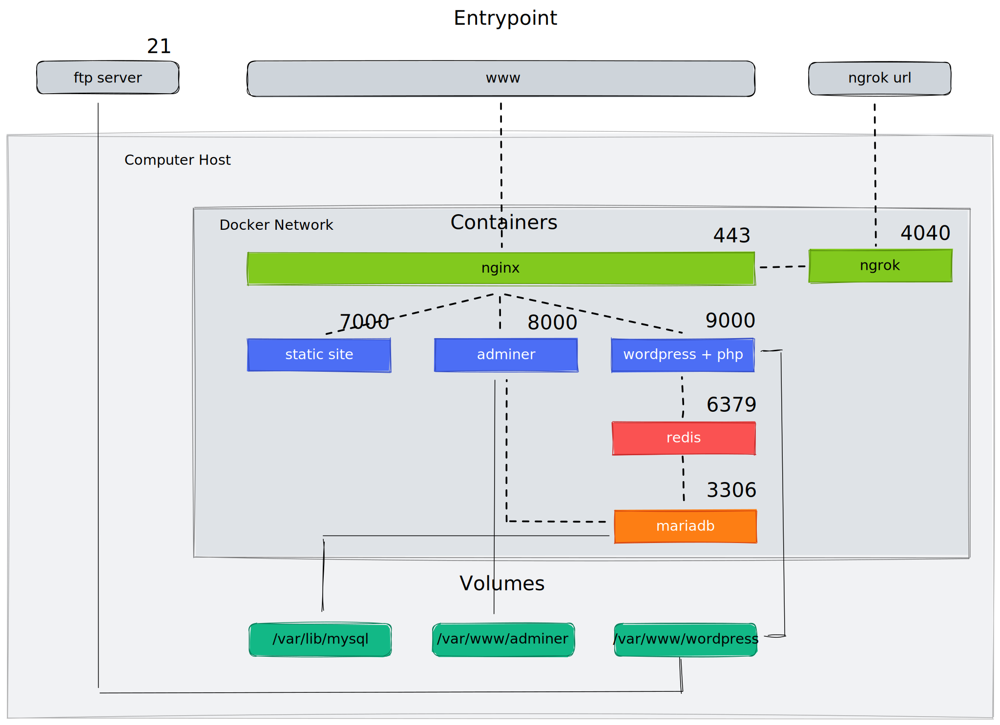

# Inception
This project aims to expand the knowledge of systems administration using [Docker](https://en.wikipedia.org/wiki/Docker_(software)).
You need to virtualize several [Docker images](https://www.techtarget.com/searchitoperations/definition/Docker-image) by creating them in your personal [virtual machine](https://www.vmware.com/topics/glossary/content/virtual-machine.html).

### What is Inception?
Inception is an individual project at [42](42sp.org.br) which requires us to build an infrastructure of services using [Docker](https://docs.docker.com/get-started/overview/), orchestrated by [Docker Compose](https://docs.docker.com/compose/).

In the mandatory part, a container with [nginx](https://www.nginx.com/resources/glossary/nginx/) and only it must be accessible through port 443, exposing the services of the internal [docker network](https://docs.docker.com/network/) for public access. The [nginx](https://www.nginx.com/resources/glossary/nginx/) service connects to the [wordpress](https://en.wikipedia.org/wiki/WordPress) container running [php-fpm](https://www.php.net/manual/en/install.fpm.php) which stores the data in a [mariadb](https://en.wikipedia.org/wiki/MariaDB) service on the network. The [wordpress](https://en.wikipedia.org/wiki/WordPress) and [mariadb](https://en.wikipedia.org/wiki/MariaDB) website data must be persisted each in its own [volume](https://docs.docker.com/storage/volumes/).

For the bonus we have to configure a container with an [FTP server](https://en.wikipedia.org/wiki/Vsftpd) that accesses the [wordpress](https://en.wikipedia.org/wiki/WordPress) [volume](https://docs.docker.com/storage/volumes/), a static site, [redis](https://redis.io/) to cache the database requests and a useful service of our choice. In this case the service chosen was [ngrok](https://ngrok.com/) to allow local services to be available on the web (public access over the internet).

### Server Structure


### Badge


#### Skills
- Rigor
- Network & system administration

#### My grade


## Getting started
**Follow the steps below**
```bash
# Clone the project and access the folder
git clone https://github.com/wwwwelton/Inception && cd Inception/

# Run make up so you can build the images and run the containers
make up

# Access the default website using the URL below
https://wleite.42.fr

# Clean output images and containers with
make fclean

# Well done!
```

## Updating

The project is regularly updated with bug fixes and code optimization.

## 📝 License

This project is licensed under the GNU General Public License v3.0 - see the [LICENSE](LICENSE) file for details.

---

Made by: Welton Leite 👋 [See my linkedin](https://www.linkedin.com/in/welton-leite-b3492985/)
